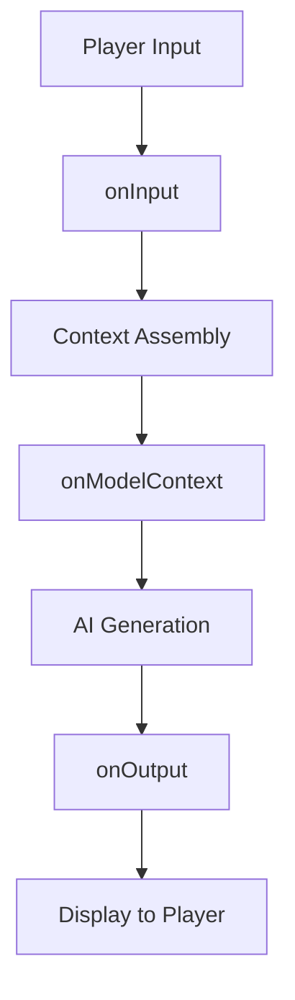

# Hooks Overview

> AI Dungeon scripts execute through three hooks that intercept the generation pipeline: onInput, onModelContext, and onOutput.

## Overview

The scripting system provides three execution points (hooks) in the generation pipeline. Each hook receives specific data, can modify that data, and returns values that affect subsequent processing. Scripts are written in JavaScript and execute in a sandboxed environment.

Scripts are defined in four tabs in the Scenario editor:
- **Library**: Shared code available to all hooks
- **Input Modifier**: The onInput hook
- **Context Modifier**: The onModelContext hook  
- **Output Modifier**: The onOutput hook

## Hook Execution Order



## The Three Hooks

### onInput

**When**: After player submits input, before context assembly

**Receives**: 
- `text` - The player's input (after Do/Say formatting)

**Can Access**:
- `state` - Persistent state object
- `info` - Adventure metadata
- `history` - Past actions
- `storyCards` - Story Card array
- `memory` - User memory object

**Returns**:
- `text` - Modified input (or original)
- `stop` - Boolean to halt generation

**Use Cases**:
- Command parsing (e.g., /stats, /help)
- Input validation or transformation
- State updates based on player actions
- Triggering effects without AI generation

### onModelContext

**When**: After context is assembled, before AI generation

**Receives**:
- `text` - The full assembled context

**Can Access**:
- All objects from onInput, plus:
- `info.maxChars` - Maximum characters for context
- `info.memoryLength` - Characters used by memory

**Returns**:
- `text` - Modified context (or original)
- `stop` - Boolean to halt generation

**Use Cases**:
- Injecting dynamic content into context
- Modifying or removing context sections
- Advanced context manipulation

### onOutput

**When**: After AI generates response, before display

**Receives**:
- `text` - The AI's generated response

**Can Access**:
- All standard objects

**Returns**:
- `text` - Modified output (or original)

**Use Cases**:
- Post-processing AI responses
- Extracting information from output
- Formatting or cleaning responses
- Triggering state updates based on AI output

## Return Values

### Text Return

Each hook should return an object containing at minimum `text`:

```
return { text };
```

If `text` is returned as empty string:
- **onInput**: Throws "Unable to run scenario scripts" error
- **onModelContext**: Context builds as if script didn't run
- **onOutput**: Throws script failure error

### Stop Flag

The `stop` flag halts the generation pipeline:

```
return { text, stop: true };
```

Effects by hook:
- **onInput**: Shows "Unable to run scenario scripts" (use for commands)
- **onModelContext**: Shows "AI is stumped" error
- **onOutput**: Changes output to "stop" (not recommended)

## Global Objects Available

All hooks have access to:

| Object | Description | Writable |
|--------|-------------|----------|
| `state` | Persistent storage | Yes |
| `info` | Adventure metadata | No |
| `history` | Action history | No |
| `storyCards` | Story Cards array | Via functions |
| `memory` | User memory | Yes |
| `text` | Hook-specific text | Yes |
| `stop` | Halt flag | Yes |

## Script Tab: Library

The Library tab contains shared code that runs before any hook. Use it for:
- Helper function definitions
- Constant declarations
- Utility code used across hooks

Library code executes fresh each turn—there is no persistent function scope between turns. Use `state` for persistence.

## Best Practices

1. **Always return an object with text**: Even if unchanged, return `{ text }`

2. **Use state for persistence**: Variables declared in scripts don't persist between turns

3. **Check for undefined**: Objects like `state.customData` may not exist on first run

4. **Log for debugging**: Use `log()` or `console.log()` to debug

5. **Handle edge cases**: First action, empty input, multiplayer considerations

## Related Documentation

- [Input Modifier](input-modifier.md)
- [Context Modifier](context-modifier.md)
- [Output Modifier](output-modifier.md)
- [State Object](state-object.md)

## Source References

- https://help.aidungeon.com/scripting
