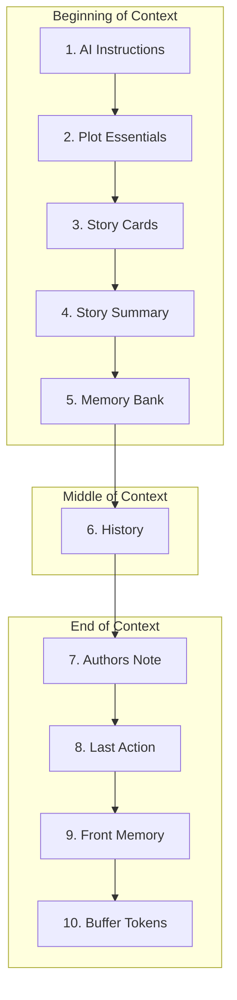

# Context Assembly Order

> The context sent to the AI is assembled in a specific order with defined positions for each element type.

## Overview

When AI Dungeon generates a response, it constructs a context by combining multiple elements in a precise order. Understanding this order is essential for effective use of Plot Components, Story Cards, and scripts.

The position of information in context affects its influence on AI generation. Content at the beginning sets the stage; content at the end has the most immediate impact on the next generated text.

## Assembly Order

The context is assembled in this sequence (top to bottom):

## Element Details

### 1. AI Instructions

**Position**: Very beginning of context

**Content**: Behavioral directives for the AI (writing style, content rules, perspective)

**Source**: Plot Components UI or scenario configuration

### 2. Plot Essentials

**Position**: After AI Instructions

**Content**: Key story details that should always be considered

**Source**: Plot Components UI or `state.memory.context` in scripts

### 3. Story Cards (Triggered)

**Position**: After Plot Essentials

**Content**: Entries from Story Cards whose triggers matched recent text

**Prefix**: Each entry is prefaced with "World Lore:"

**Selection**: Based on trigger recency and frequency

### 4. Story Summary

**Position**: After Story Cards

**Content**: Running summary of the adventure's plot

**Source**: Auto Summarization feature or manual entry

### 5. Memory Bank

**Position**: After Story Summary

**Content**: Semantically retrieved memories relevant to current action

**Selection**: Ranked by embedding similarity to recent actions

### 6. History

**Position**: Middle of context

**Content**: Recent actions from the adventure (player inputs and AI outputs)

**Selection**: Most recent first, as many as fit in allocated space

### 7. Author's Note

**Position**: Near end, before last action

**Content**: Short-term narrative guidance (tone, style, genre hints)

**Source**: Plot Components UI or `state.memory.authorsNote` in scripts

### 8. Last Action

**Position**: After Author's Note

**Content**: The most recent player input being responded to

**Status**: Always included in full

### 9. Front Memory

**Position**: Very end, after last action

**Content**: Hidden text injected by scripts

**Source**: `state.memory.frontMemory` in scripts only

**Notes**: Not accessible from UI; powerful position for immediate influence

### 10. Buffer Tokens

**Position**: Absolute end

**Content**: Reserved space for AI response generation

**Purpose**: Ensures room for the AI to generate output

## Positional Influence

The AI's attention is not uniform across context:

**Beginning**: Sets foundational rules and context
- AI Instructions define behavior patterns
- Plot Essentials establish key facts
- Less immediate influence on specific word choices

**Middle**: Provides narrative continuity
- History shows story flow
- Memories fill in relevant background

**End**: Strongest immediate influence
- Author's Note shapes tone of next output
- Last Action directly prompts response
- Front Memory has maximum influence on next generation

## Priority When Trimming

When context exceeds available space, elements are trimmed in this priority (highest priority = kept longest):

1. **Always Full**: Front Memory, Last Action
2. **High Priority**: Author's Note, Plot Essentials
3. **Medium Priority**: AI Instructions, Story Summary
4. **Flexible**: Story Cards, History, Memory Bank

Required Elements are capped at 70% of context. Dynamic Elements fill the remaining 30%.

## Related Documentation

- [Required Elements](required-elements.md)
- [Dynamic Elements](dynamic-elements.md)
- [Allocation Rules](allocation-rules.md)
- [Context Window Explained](../00-foundation/context-window-explained.md)

## Source References

- https://help.aidungeon.com/faq/what-goes-into-the-context-sent-to-the-ai
