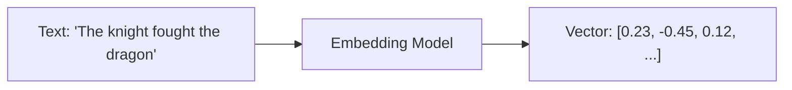

# Embeddings and Vectors

> The Memory Bank uses AI embeddings to convert text into numerical vectors, enabling semantic similarity search for memory retrieval.

## Overview

The Memory Bank's ability to retrieve relevant memories depends on AI embedding technology. This document explains how embeddings work and how they enable intelligent memory retrieval in AI Dungeon.

## What Are Embeddings?

An embedding is a numerical representation of text that captures its semantic meaning. When text is "embedded," it's converted from words into a list of numbers (a vector) that represents its meaning in a multidimensional space.

**Key Properties**:
- Similar meanings → similar vectors
- Related concepts cluster together
- Distance between vectors indicates semantic distance

## How Embedding Works

### Text to Vector

1. Text is input to an embedding model
2. The model processes the text
3. Output is a vector (list of numbers), typically hundreds of dimensions

### Similarity Calculation

Once texts are embedded, their similarity is calculated mathematically:

1. Take two vectors
2. Calculate their distance (often using cosine similarity)
3. Higher similarity = more related meaning

**Example Similarities** (conceptual):
- "water" and "liquid" → high similarity
- "water" and "ocean" → high similarity
- "water" and "fire" → lower similarity
- "water" and "economics" → low similarity

## Embedding Models

Embedding models are specialized AI models trained to create meaningful vector representations:

- Trained on vast text corpora
- Learn relationships between words and concepts
- Produce consistent representations

AI Dungeon uses embedding models optimized for narrative and conversational content.

## Application in Memory Bank

### Memory Storage

When a memory is created:
1. The memory text is embedded
2. Both text and vector are stored
3. The vector enables future retrieval

### Memory Retrieval

When generating a response:
1. The current action is embedded
2. This vector is compared to all stored memory vectors
3. Memories with most similar vectors are retrieved

### Why This Works

If the current action mentions "returning to the castle," the embedding captures that meaning. Stored memories about "arriving at the castle" or "the castle's great hall" have similar embeddings, so they're retrieved—even without exact keyword matches.

## Semantic vs. Keyword Search

| Keyword Search | Semantic Search |
|---------------|-----------------|
| Matches exact words | Matches meaning |
| "castle" finds "castle" | "castle" finds "fortress," "keep," "stronghold" |
| Misses synonyms | Captures synonyms |
| Fast, simple | More sophisticated |

The Memory Bank uses semantic search, which is why it can surface relevant memories even when the exact words differ.

## Practical Implications

### What Gets Retrieved

Memories are retrieved based on:
- Conceptual similarity to current action
- Thematic connections
- Relevant entities (characters, locations)

### What Might Be Missed

- Very abstract connections
- Information requiring inference
- Content the embedding model didn't capture well

### Improving Retrieval

While you can't control embeddings directly, you can:
- Write clear, specific actions
- Use consistent names for characters/locations
- Let the system learn your story's terminology

## Limitations

**Model Dependent**: Retrieval quality depends on the embedding model

**Not Perfect**: Semantic similarity isn't the same as narrative relevance

**No User Control**: You can't see or modify embeddings

**Context Window**: Even good retrieval is limited by context space allocation

## Related Documentation

- [Memory Bank](memory-bank.md)
- [Memory System Overview](memory-system-overview.md)

## Source References

- https://help.aidungeon.com/faq/the-memory-system
