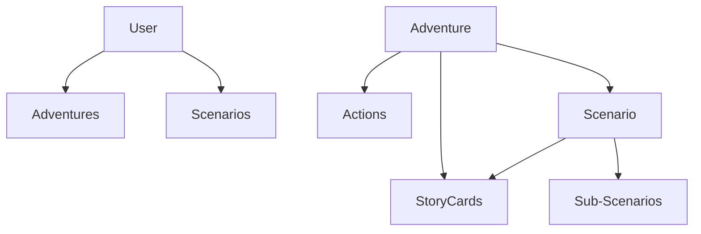

# API Entities

> Key data entities exposed through AI Dungeon's GraphQL API.

## Overview

The GraphQL API operates on structured entities representing AI Dungeon's core concepts. Understanding these entities helps when working with the API programmatically.

## Primary Entities

### Adventure

Represents an individual playthrough:

**Key Fields**:
- `id`: Unique identifier
- `title`: Adventure name
- `description`: Adventure description
- `publicId`: Public sharing ID
- `createdAt`: Creation timestamp
- `updatedAt`: Last modification
- `scenario`: Associated Scenario (if any)
- `actions`: List of story actions

**Operations**:
- Query adventures
- Create new adventure
- Update adventure properties
- Delete adventure

### Scenario

Template for starting Adventures:

**Key Fields**:
- `id`: Unique identifier
- `title`: Scenario name
- `description`: Scenario description
- `prompt`: Initial prompt text
- `memory`: Plot Essentials content
- `authorsNote`: Author's Note content
- `publicId`: Sharing ID
- `published`: Visibility status
- `storyCards`: Associated Story Cards
- `options`: Sub-scenarios for branching

**Operations**:
- Query scenarios
- Create scenario
- Update scenario
- Delete scenario
- Publish/unpublish

### StoryCard (WorldInfo)

Triggered lore entries:

**Key Fields**:
- `id`: Unique identifier
- `keys`: Trigger keywords
- `entry`: Content text
- `type`: Card type
- `title`: Display name
- `description`: Notes field

**Note**: API may use `worldInfo` or `worldEntry` terminology (legacy names).

**Operations**:
- List story cards
- Create story card
- Update story card
- Delete story card

### Action

Individual story turn:

**Key Fields**:
- `id`: Unique identifier
- `text`: Action content
- `type`: Action type (do, say, story, continue, etc.)
- `createdAt`: Timestamp
- `updatedAt`: Last edit timestamp

**Operations**:
- Query actions
- Create action (submit input)
- Update action (edit)
- Delete action (undo)

### User

Player account:

**Key Fields**:
- `id`: Unique identifier
- `username`: Display name
- `email`: Account email (private)
- `subscription`: Tier information

**Operations**:
- Query current user
- Update profile
- Subscription management

## Relationships

Entities relate to each other:



## Working with the API

### Query Example (Conceptual)

Fetch a scenario with its story cards:
```graphql
query GetScenario($id: ID!) {
  scenario(id: $id) {
    id
    title
    prompt
    storyCards {
      keys
      entry
      type
    }
  }
}
```

### Mutation Example (Conceptual)

Update a story card:
```graphql
mutation UpdateCard($id: ID!, $keys: String!, $entry: String!) {
  updateWorldInfo(id: $id, keys: $keys, entry: $entry) {
    id
    keys
    entry
  }
}
```

## Schema Discovery

The full schema can be explored via:
- GraphQL introspection queries
- The introspection.json file in the local folder
- Tools like GraphQL Playground

## API Versioning

No formal versioning is exposed:
- API may change as platform updates
- Field names and types may evolve
- Monitor for breaking changes

## Related Documentation

- [GraphQL Overview](graphql-overview.md)
- [Card Import/Export](../04-story-cards/card-import-export.md)

## Source References

- https://help.aidungeon.com/scripting
