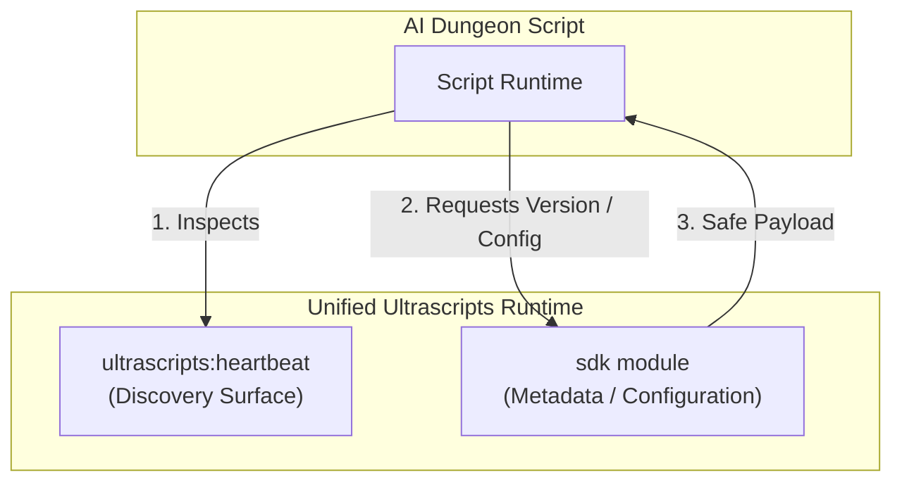

# 05 - BetterDungeon SDK Specification

> This document is the definitive reference specification for the **BetterDungeon SDK** (`sdk`) module. It reflects the shipped production implementation.

The BetterDungeon SDK module acts as a secure metadata bridge between the host browser extension and scenario scripts running inside AI Dungeon. It allows scripts to introspect client versions, capability eras, and safe player-configured preferences without breaching security boundaries (such as leaking API keys) or overloading the heartbeat discovery protocol.

---

## The Architectural Role of the SDK

BetterDungeon enforces a strict separation of concerns between discovery and metadata:



1. **Heartbeat (`ultrascripts:heartbeat`) is the sole discovery surface.** It advertises whether the Ultrascripts runtime is present, which first-party or third-party modules are active, and what operations (`ops`) they expose.
2. **The SDK (`sdk`) module is a dedicated query service.** It answers details about the extension's execution environment. The heartbeat does not duplicate SDK metadata, and the SDK does not duplicate heartbeat discovery.
3. **No security credentials are ever exposed.** All configuration fields returned are thoroughly sanitized. API keys and absolute session tokens are completely omitted.

---

## Shipped Module Contract

The `sdk` module is registered as a first-party, ops-only module. 

- **Module ID:** `sdk`
- **Default Enablement:** Enabled
- **Exposed Operations:** `version`, `config`

### 1. `version` Operation

Returns structural details about the active software versions to support progressive enhancement and feature branching.

* **Op Name:** `version`
* **Idempotency:** `safe` (replays are safe)
* **Timeout:** `1000ms`
* **Arguments:** None (expects empty object `{}`)

#### Response Payload Schema
```json
{
  "sdkVersion": "1.0.0",
  "betterDungeonVersion": "2.0.0",
  "ultrascriptsProtocol": 1,
  "ultrascriptsClient": "BetterDungeon"
}
```

* **`sdkVersion`**: Version string of the SDK module specifications (currently `"1.0.0"`).
* **`betterDungeonVersion`**: The actual manifest version of the installed extension.
* **`ultrascriptsProtocol`**: Integer version of the card-driven transport protocol (currently `1`).
* **`ultrascriptsClient`**: Name of the client runtime (always `"BetterDungeon"`).

---

### 2. `config` Operation

Exposes player-configured preferences and extension toggles that directly influence how a scenario script should tailor its behavior or UI.

* **Op Name:** `config`
* **Idempotency:** `safe` (replays are safe)
* **Timeout:** `1500ms`
* **Arguments:** None (expects empty object `{}`)

#### Response Payload Schema
```json
{
  "sdkVersion": "1.0.0",
  "betterDungeonVersion": "1.2.1",
  "ultrascriptsProtocol": 1,
  "ultrascriptsClient": "BetterDungeon",
  "features": {
    "ultrascripts": true,
    "markdown": true,
    "command": true,
    "try": true,
    "triggerHighlight": true,
    "hotkey": true,
    "favoriteInstructions": true,
    "inputModeColor": true,
    "characterPreset": true,
    "autoSee": false,
    "notes": true,
    "storyCardModalDock": true,
    "inputHistory": true,
    "textToSpeech": false
  },
  "ultrascripts": {
    "enabled": true,
    "runtimeEnabled": true,
    "debug": false,
    "modulePreferences": {
      "scripture": true,
      "webfetch": true,
      "clock": true,
      "sdk": true,
      "geolocation": true,
      "weather": true,
      "network": true,
      "system": true,
      "ai": true
    },
    "scriptureDisplay": {
      "size": "normal",
      "maxHeight": "medium",
      "layout": "balanced"
    },
    "webfetch": {
      "savedOriginCount": 0,
      "allowCount": 0,
      "denyCount": 0
    },
    "ai": {
      "configured": true,
      "defaultModel": "google/gemini-2.0-flash-exp:free",
      "costControls": {
        "freeModelsOnly": true,
        "advancedOpen": false,
        "maxPromptPricePerMillion": 0,
        "maxCompletionPricePerMillion": 0,
        "perCallEstimateCap": 0,
        "dailySpendCap": 0,
        "monthlySpendCap": 0
      }
    }
  }
}
```

#### Fields Explanation
- **`features`**: Map of standard BetterDungeon features and their active checkbox states in the main extension settings.
- **`ultrascripts.enabled`**: Main master switch for Ultrascripts.
- **`ultrascripts.runtimeEnabled`**: Boolean reflecting if the Ultrascripts core runner is actively active on the current page.
- **`ultrascripts.debug`**: Indicates if Ultrascripts debug log streams are enabled.
- **`ultrascripts.modulePreferences`**: Specific enabled/disabled states for all 9 first-party modules.
- **`ultrascripts.scriptureDisplay`**: Sanitized visual styling config for `scripture` layout renders:
  - `size`: `"compact"` | `"normal"` | `"comfortable"` | `"large"`
  - `maxHeight`: `"short"` | `"medium"` | `"tall"`
  - `layout`: `"balanced"` | `"stacked"`
- **`ultrascripts.webfetch`**: Quantitative metrics representing WebFetch consent settings (`savedOriginCount`, `allowCount`, `denyCount`) without leaking specific allowed domains.
- **`ultrascripts.ai`**: Curated OpenRouter metadata:
  - `configured`: Boolean showing if the player has entered a valid OpenRouter API key. **The key itself is NEVER exposed.**
  - `defaultModel`: String name of the default configured provider model.
  - `costControls`: User-specified usage safety metrics to protect OpenRouter accounts.

---

## Wire Integration Flow

Scripts query the SDK module through the standard two-way card mutation exchange.

```text
AI Dungeon Script                                  BetterDungeon Extension
=================                                  =======================

1. Writes Request Envelope into 'ultrascripts:out':
   {
     "v": 1,
     "requests": [{
       "id": "turn-1-sdk-query-1",
       "module": "sdk",
       "op": "config",
       "args": {}
     }],
     "acks": []
   }
   
                                --- WS Card Update --->
                                
                                                   2. ws-stream.js captures mutation.
                                                   3. ops-dispatcher.js parses envelope.
                                                   4. Invokes sdk module configOp.
                                                   5. Queries background script safely.
                                                   6. Sanitizes results.
                                                   7. Writes response card 'ultrascripts:in:sdk'.
                                                   
                                <--- WS Card update ---
                                
8. Polls & reads 'ultrascripts:in:sdk':
   {
     "v": 1,
     "responses": {
       "turn-1-sdk-query-1": {
         "status": "ok",
         "data": { ... safe config payload ... },
         "completedLiveCount": 1
       }
     }
   }
   
9. Acknowledges receipt in the next 'ultrascripts:out' write.
```

---

## Script-Side Authoring Pattern

Scenario authors are encouraged to wrap raw SDK card lookups in clean, reusable
library helpers. The public reference helper now lives in Quick Start; this
spec keeps only the minimal progressive capability shape.

```js
// Scenario Script Library Initializer
globalThis.bd = globalThis.bd || {};
var bd = globalThis.bd;
bd.sdk = bd.sdk || {};

// Helper to inspect the current live heartbeat
function getHeartbeat() {
  var cards = Array.isArray(storyCards) ? storyCards : [];
  for (var i = 0; i < cards.length; i++) {
    var card = cards[i];
    var matches = card && (
      card.title === 'ultrascripts:heartbeat' ||
      card.key === 'ultrascripts:heartbeat' ||
      card.keys === 'ultrascripts:heartbeat' ||
      (Array.isArray(card.keys) && card.keys.indexOf('ultrascripts:heartbeat') !== -1)
    );
    if (matches) {
      var raw = card.value !== undefined ? card.value
        : card.entry !== undefined ? card.entry
          : card.description || '{}';
      try { return JSON.parse(raw || '{}'); } catch(e) { return null; }
    }
  }
  return null;
}

// Inspect availability of a module
bd.sdk.hasModule = function (moduleId) {
  var hb = getHeartbeat();
  var mods = (hb && Array.isArray(hb.modules)) ? hb.modules : [];
  for (var i = 0; i < mods.length; i++) {
    if (mods[i] && mods[i].id === moduleId) return true;
  }
  return false;
};

// Inspect availability of a specific operation
bd.sdk.hasOp = function (moduleId, opName) {
  var hb = getHeartbeat();
  var mods = (hb && Array.isArray(hb.modules)) ? hb.modules : [];
  for (var i = 0; i < mods.length; i++) {
    var mod = mods[i];
    if (!mod || mod.id !== moduleId) continue;
    var ops = Array.isArray(mod.ops) ? mod.ops : [];
    return ops.indexOf(opName) !== -1;
  }
  return false;
};
```

---

## Testing & Regression Surface

The production SDK has a dedicated end-to-end integration test suite located at:
[BetterDungeon/tests/aid-scripts/sdk-module/](file:///c:/Users/compu/OneDrive/Documents/CascadeProjects/Projects/Web%20Dev/BetterEcosystem/BetterDungeon/tests/aid-scripts/sdk-module/)

### Coverage Surface
1. **Heartbeat discovery:** Asserts the `sdk` module is correctly parsed, mounted, and listed in the core heartbeat.
2. **Version operation:** Validates the presence of `sdkVersion`, `betterDungeonVersion`, `ultrascriptsProtocol`, and `ultrascriptsClient` under `ultrascripts:in:sdk`.
3. **Config operation:** Asserts the background authoritative communication path is functional. Validates the structural schema and completeness of returned values for `features`, `ultrascripts.modulePreferences`, `ultrascripts.scriptureDisplay`, and `ultrascripts.ai`.
4. **No duplicate heartbeats:** Verifies the Core handles heartbeat duplicates appropriately without crashing the `sdk` module listeners.
5. **Clean acks:** Validates the scenario script successfully acknowledges the SDK responses, which are then cleaned from the active response card.
